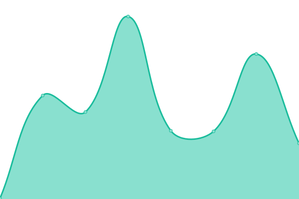
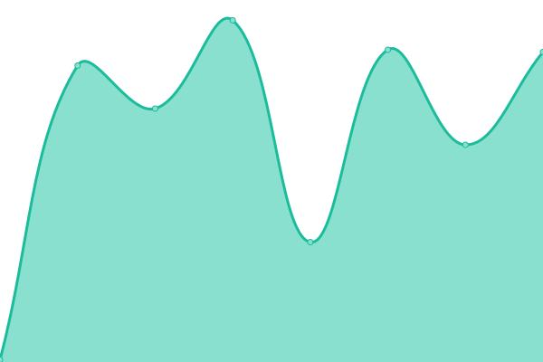
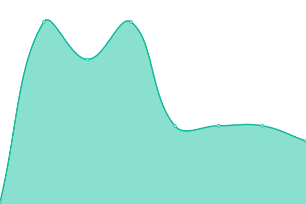
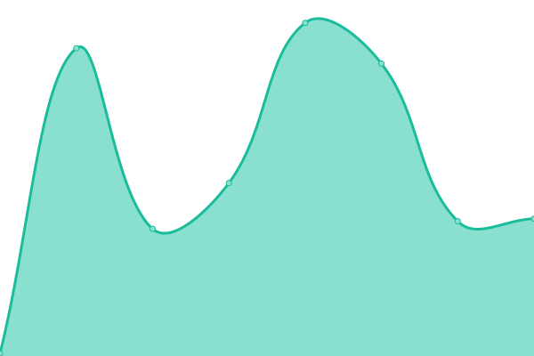
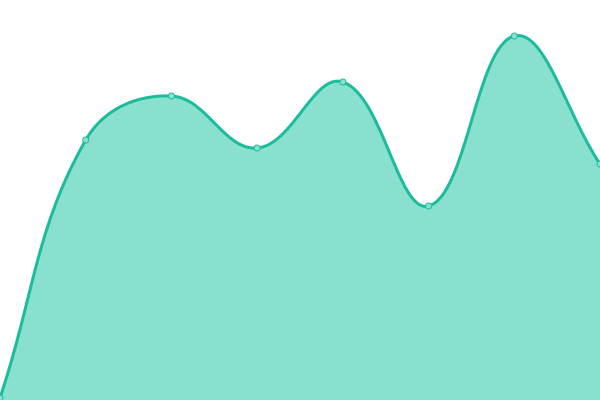

# [📈 Live Status](https://status.skiptheswipes.com): <!--live status--> **🟥 Complete outage**

This repository contains the open-source uptime monitor and status page for [Skip The Swipes, Inc.](https://skiptheswipes.com/), powered by [Upptime](https://github.com/upptime/upptime).

With [Upptime](https://upptime.js.org), you can get your own unlimited and free uptime monitor and status page, powered entirely by a GitHub repository. We use [Issues](https://github.com/SkipTheSwipes/upptime/issues) as incident reports, [Actions](https://github.com/SkipTheSwipes/upptime/actions) as uptime monitors, and [Pages](https://status.skiptheswipes.com) for the status page.

<!--start: status pages-->
<!-- This summary is generated by Upptime (https://github.com/upptime/upptime) -->
<!-- Do not edit this manually, your changes will be overwritten -->
<!-- prettier-ignore -->
| URL | Status | History | Response Time | Uptime |
| --- | ------ | ------- | ------------- | ------ |
|  [Skip The Swipes](https://skiptheswipes.com) | 🟥 Down | [skip-the-swipes.yml](https://github.com/SkipTheSwipes/upptime/commits/HEAD/history/skip-the-swipes.yml) | 

 0ms
     
 | 

<a href="https://status.skiptheswipes.com/history/skip-the-swipes">0.00%</a>
    

|  [Skip The Swipes API](https://api.skiptheswipes.com) | 🟥 Down | [skip-the-swipes-api.yml](https://github.com/SkipTheSwipes/upptime/commits/HEAD/history/skip-the-swipes-api.yml) | 

 111ms
     
 | 

<a href="https://status.skiptheswipes.com/history/skip-the-swipes-api">0.00%</a>
    

|  WhatsApp Server | 🟥 Down | [whats-app-server.yml](https://github.com/SkipTheSwipes/upptime/commits/HEAD/history/whats-app-server.yml) | 

 0ms
     
 | 

<a href="https://status.skiptheswipes.com/history/whats-app-server">0.00%</a>
    

|  Discord Bot Server | 🟥 Down | [discord-bot-server.yml](https://github.com/SkipTheSwipes/upptime/commits/HEAD/history/discord-bot-server.yml) | 

 114ms
     
 | 

<a href="https://status.skiptheswipes.com/history/discord-bot-server">0.00%</a>
    

|  [Skip The Swag](https://skiptheswag.com) | 🟥 Down | [skip-the-swag.yml](https://github.com/SkipTheSwipes/upptime/commits/HEAD/history/skip-the-swag.yml) | 

 0ms
     
 | 

<a href="https://status.skiptheswipes.com/history/skip-the-swag">0.00%</a>
    

<!--end: status pages-->

[**Visit our status website →**](https://status.skiptheswipes.com)

## 📄 License

- Powered by: [Upptime](https://github.com/upptime/upptime)
- Code: [MIT](./LICENSE) © [Skip The Swipes, Inc.](https://skiptheswipes.com/)
- Data in the `./history` directory: [Open Database License](https://opendatacommons.org/licenses/odbl/1-0/)
