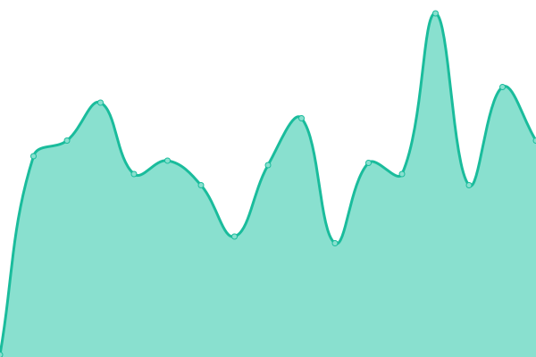
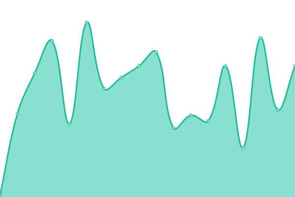
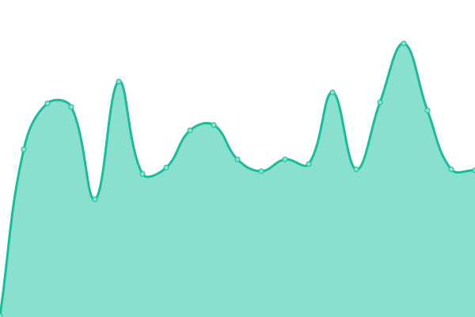

# [📈 Live Status](https://status2.skiptheswipes.com): <!--live status--> **🟩 All systems operational**

This repository contains the open-source uptime monitor and status page for [Skip The Swipes, Inc.](https://skiptheswipes.com/), powered by [Upptime](https://github.com/upptime/upptime).

With [Upptime](https://upptime.js.org), you can get your own unlimited and free uptime monitor and status page, powered entirely by a GitHub repository. We use [Issues](https://github.com/SkipTheSwipes/upptime/issues) as incident reports, [Actions](https://github.com/SkipTheSwipes/upptime/actions) as uptime monitors, and [Pages](https://status2.skiptheswipes.com) for the status page.

<!--start: status pages-->
<!-- This summary is generated by Upptime (https://github.com/upptime/upptime) -->
<!-- Do not edit this manually, your changes will be overwritten -->
<!-- prettier-ignore -->
| URL | Status | History | Response Time | Uptime |
| --- | ------ | ------- | ------------- | ------ |
|  [Main Site](https://skiptheswipes.com) | 🟩 Up | [main-site.yml](https://github.com/SkipTheSwipes/upptime/commits/HEAD/history/main-site.yml) | 

 85ms
     
 | 

<a href="https://status2.skiptheswipes.com/history/main-site">46.25%</a>
    

|  [API](https://api.skiptheswipes.com) | 🟩 Up | [api.yml](https://github.com/SkipTheSwipes/upptime/commits/HEAD/history/api.yml) | 

 79ms
     
 | 

<a href="https://status2.skiptheswipes.com/history/api">46.26%</a>
    

|  [Webstore (Skip The Swag)](https://skiptheswag.com) | 🟩 Up | [webstore-skip-the-swag.yml](https://github.com/SkipTheSwipes/upptime/commits/HEAD/history/webstore-skip-the-swag.yml) | 

 191ms
     
 | 

<a href="https://status2.skiptheswipes.com/history/webstore-skip-the-swag">100.00%</a>
    

<!--end: status pages-->

[**Visit our status website →**](https://status2.skiptheswipes.com)

## 📄 License

- Powered by: [Upptime](https://github.com/upptime/upptime)
- Code: [MIT](./LICENSE) © [Skip The Swipes, Inc.](https://skiptheswipes.com/)
- Data in the `./history` directory: [Open Database License](https://opendatacommons.org/licenses/odbl/1-0/)
